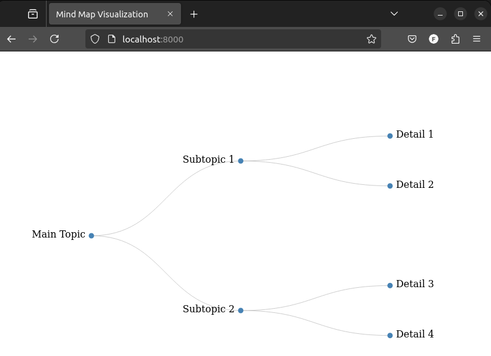

# Visualize json as a mind map diagram
## How to use

- Overwrite the contents of test_data.json with the json you want to visualize
- Run the following command 
  - For Python 3:

    `python -m http.server 8000`
  - For Python 2:
   
    `python -m SimpleHTTPServer 8000`
  - For Node.js/http-server package:

    ```shell 
    npm install -g http-server
    http-server -p 8000
  - Open a the browser and put http://localhost:8000 in the address bar

    You should see something similiar to this:

    